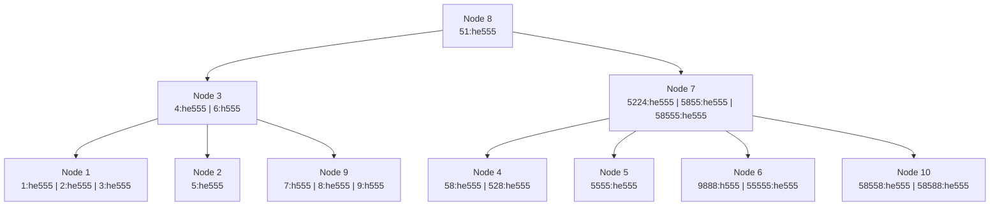

# B-tree Visualization

Current state of the B-tree:

```mermaid
graph TD
    n8["Node 8<br>51:he555"]
    n3["Node 3<br>4:he555 | 6:h555"]
    n1["Node 1<br>1:he555 | 2:he555 | 3:he555"]
    n2["Node 2<br>5:he555"]
    n9["Node 9<br>7:h555 | 8:he555 | 9:h555"]
    n7["Node 7<br>5224:he555 | 5855:he555 | 58555:he555"]
    n4["Node 4<br>58:he555 | 528:he555"]
    n5["Node 5<br>5555:he555"]
    n6["Node 6<br>9888:h555 | 55555:he555"]
    n10["Node 10<br>58558:he555 | 58588:he555"]
    n8 --> n3
    n3 --> n1
    n3 --> n2
    n3 --> n9
    n8 --> n7
    n7 --> n4
    n7 --> n5
    n7 --> n6
    n7 --> n10
```
